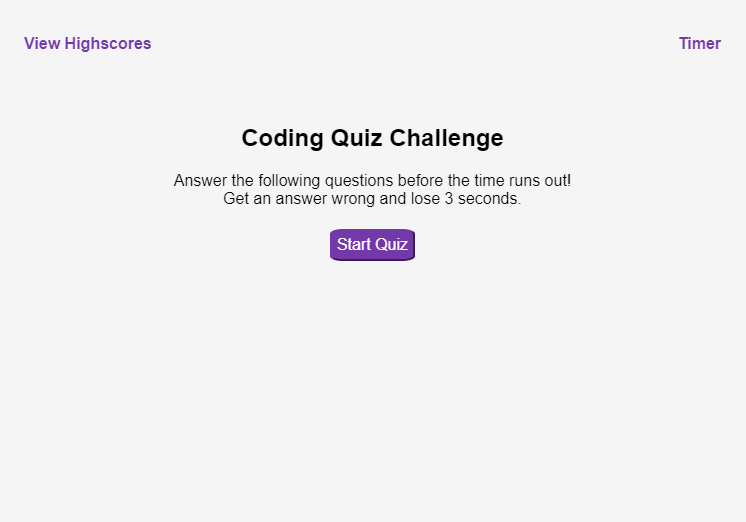

# Coding Quiz

## Description

I built a timed coding quiz with multiple-choice questions to test my knowledge of some basic topics covered in class. This app runs in the browser and features dynamically updated HTML and CSS powered by JavaScript code. It has a clean, polished, and responsive user interface. 

## Mock-Up

The following shows the layout of the application:

## Link
